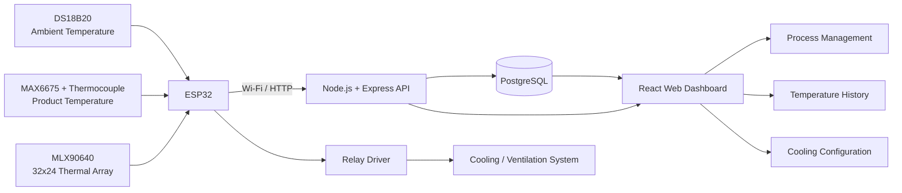
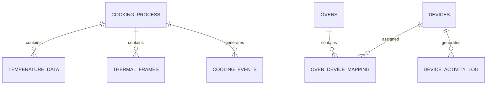

# CookEye

### IoT-Based Monitoring and Automation System for Meat Smoking Processes

CookEye is a full-stack IoT system designed to monitor, record, and assist in the control of traditional meat smoking processes.

The project integrates embedded hardware, multiple temperature sensing technologies, thermal imaging, a REST API, a PostgreSQL database, and a web-based monitoring dashboard into a single system.

CookEye was developed as an engineering thesis project with the goal of transforming a traditionally manual process into a digitally monitored and data-driven workflow.

---

## System Overview

Traditional smoking processes often rely on periodic manual temperature measurements and operator experience.

CookEye introduces continuous monitoring by combining:

* Ambient temperature sensing
* Internal product temperature sensing
* 32 × 24 thermal imaging
* Wi-Fi telemetry
* Process-based data storage
* Historical temperature visualization
* Automated cooling control
* Web-based process management

The system connects the physical smoking environment directly with a web application through an ESP32 and REST API.

---

## System Architecture



### Data Flow

```text
Physical Process
      │
      ▼
Temperature & Thermal Sensors
      │
      ▼
     ESP32
      │
      │ Wi-Fi / HTTP + JSON
      ▼
Node.js / Express REST API
      │
      ▼
   PostgreSQL
      │
      ▼
 React Dashboard
```

---

# Hardware

The embedded system is based on an ESP32 and integrates three complementary temperature acquisition methods.

## ESP32

The ESP32 acts as the edge device responsible for:

* Sensor acquisition
* Wi-Fi connectivity
* Process identification
* JSON payload generation
* Communication with the backend
* Local relay control
* Basic fault detection

Telemetry is periodically transmitted to the backend through HTTP.

---

## DS18B20

The DS18B20 digital temperature sensor is used to measure the surrounding or chamber temperature.

```text
DS18B20
   │
OneWire
   │
 ESP32
```

The firmware verifies sensor connectivity before accepting a measurement.

---

## Thermocouple + MAX6675

A thermocouple connected through a MAX6675 interface is used to obtain the internal temperature of the meat product.

```text
Thermocouple
     │
  MAX6675
     │
    SPI
     │
   ESP32
```

This provides a second temperature channel independent from the chamber temperature.

---

## MLX90640 Thermal Sensor

CookEye also integrates an MLX90640 infrared thermal array.

The sensor provides:

```text
32 × 24 = 768 temperature measurements
```

for every thermal frame.

The ESP32 reads the matrix over I²C and includes the entire 768-value frame in the telemetry packet sent to the backend.

This allows CookEye to capture spatial temperature information in addition to conventional point measurements.

---

## Cooling / Ventilation Control

The ESP32 can control a relay-driven ventilation or cooling device.

A hysteresis strategy is used to prevent continuous relay switching around the temperature threshold.

Conceptually:

```text
Temperature >= Upper Limit
        │
        ▼
    Cooling ON


Temperature <= Upper Limit - Hysteresis
        │
        ▼
    Cooling OFF
```

This introduces local control capability even at the embedded layer.

> The current firmware contains local threshold values for relay control, while the backend also includes infrastructure for storing and exposing active cooling configurations.

---

# Software Architecture

CookEye follows a layered architecture:

```text
┌───────────────────────────────┐
│        React Frontend         │
├───────────────────────────────┤
│      REST API / Express       │
├───────────────────────────────┤
│        Service Layer          │
├───────────────────────────────┤
│         PostgreSQL            │
├───────────────────────────────┤
│         ESP32 / IoT           │
└───────────────────────────────┘
```

---

# Backend

The backend is implemented using Node.js and Express.

### Main technologies

* Node.js
* Express
* PostgreSQL
* `pg`
* CORS
* Morgan
* dotenv
* REST APIs

The backend serves as the communication layer between the embedded device, database, and frontend.

---

## Main IoT Endpoints

### Current process

```http
GET /api/current-process
```

Returns the most recent process whose state is either:

```text
pending
active
```

The ESP32 uses this endpoint to associate incoming measurements with the appropriate cooking process.

---

### Temperature and thermal telemetry

```http
POST /api/temperature_data
```

A typical embedded payload has the following structure:

```json
{
  "sensor_id": 2,
  "process_id": 1,
  "temperature_ambiente": 26.4,
  "temperature_termocupla": 72.8,
  "matrix": [
    "... 768 MLX90640 temperature values ..."
  ]
}
```

The backend validates the payload and stores both conventional temperature measurements and the associated thermal frame.

---

### Cooling status

```http
GET /api/capture-status
```

Provides the current capture/control state.

---

### Active cooling configuration

```http
GET /api/air_cooling/active-config
```

Provides parameters such as:

* Lower temperature limit
* Upper temperature limit
* Hysteresis
* Enabled state

---

## Process Management

Cooking processes are represented independently from their telemetry.

A process can contain information such as:

* Product
* Cut
* Weight
* Target temperature
* Process state
* Creation time
* Start time
* Elapsed processing time

Typical states include:

```text
pending
active
completed
aborted
```

This design allows sensor measurements to remain associated with the process that generated them.

---

# Thermal Frame Storage

One of the design challenges was storing the large amount of data generated by the MLX90640.

Each frame contains:

```text
768 floating-point temperature values
```

Instead of directly storing the complete floating-point array, the backend implements a compact encoding mechanism.

For each frame:

1. Minimum and maximum temperatures are calculated.
2. Values are normalized to the range `[0,1]`.
3. The normalized values are quantized into signed 16-bit integers.
4. The resulting data is stored as a binary PostgreSQL `BYTEA` object.
5. The original minimum and maximum values are stored for reconstruction.

```text
MLX90640 Frame
      │
      │ 768 floats
      ▼
Find Min / Max
      │
      ▼
Normalization
      │
      ▼
16-bit Quantization
      │
      ▼
Binary Buffer
      │
      ▼
PostgreSQL BYTEA
```

The encoding is identified as:

```text
int16_norm_v1
```

A shared `sample_uuid` links the thermal frame to its corresponding ambient and product temperature measurement.

---

# Database

CookEye uses PostgreSQL as its persistence layer.

The schema is designed around cooking processes, telemetry, device information, thermal frames, users, and cooling configurations.

Important entities include:

```text
cooking_process
temperature_data
thermal_frames
air_cooling_configurations
cooling_active_config
cooling_events
users
ovens
devices
oven_device_mapping
device_activity_log
```

---

## Core Relationships



This structure was designed to support future expansion from a single prototype toward multiple ovens and IoT devices.

---

# Frontend

The web interface is built with React.

### Main technologies

* React 18
* React Router
* Tailwind CSS
* Chart.js
* Font Awesome

The UI was developed using the Notus React / Creative Tim open-source template as a visual foundation and adapted to the CookEye monitoring workflow.

---

## Dashboard

The dashboard provides graphical visualization of system information and temperature measurements.

CookEye uses reusable chart components to display collected data.

---

## Process Management

Users can create and manage smoking processes through the web interface.

Process information can include:

```text
Meat Product
Cut Type
Weight
Target Temperature
```

The frontend communicates with the REST API to create and update process information.

---

## Historical Process Visualization

Temperature records are associated with individual cooking processes.

The process history view retrieves the full time series for a selected process and displays:

```text
Ambient Temperature
        +
Product Temperature
        │
        ▼
      Time
```

This makes it possible to inspect the thermal evolution of a complete smoking process after data collection.

---

## Cooling Configuration

The web interface also includes cooling configuration management.

Configurations can define:

```text
Configuration Name
Minimum Temperature
Maximum Temperature
```

These configurations provide the software infrastructure required for configurable cooling strategies.

---

# Repository Structure

```text
CookEye_system/
│
├── ArduinoScript/
│   └── PROYECTO_TESIS/
│       └── PROYECTO_TESIS.ino
│
├── backend/
│   ├── src/
│   │   ├── Controllers/
│   │   ├── middlewares/
│   │   ├── routes/
│   │   ├── services/
│   │   ├── config/
│   │   └── utils/
│   │
│   ├── package.json
│   └── package-lock.json
│
├── front/
│   ├── public/
│   ├── src/
│   │   ├── components/
│   │   ├── hooks/
│   │   ├── layouts/
│   │   ├── routes/
│   │   └── views/
│   │
│   ├── package.json
│   └── package-lock.json
│
├── database/
│   └── CookEye.sql
│
├── .gitignore
└── README.md
```

---

# Getting Started

## Requirements

### Software

* Node.js 18+
* npm
* PostgreSQL
* Arduino IDE

### Hardware

* ESP32
* DS18B20
* MAX6675
* Thermocouple
* MLX90640
* Relay / transistor driver circuit
* Cooling or ventilation system

---

# Database Setup

Create a PostgreSQL database and execute the CookEye schema.

Example:

```bash
psql -U postgres -d cookeye -f database/CookEye.sql
```

Create the backend environment file:

```bash
backend/.env
```

Example:

```env
PORT=5000

DB_HOST=localhost
DB_PORT=5432
DB_NAME=cookeye
DB_USER=your_user
DB_PASSWORD=your_password
```

> Never commit real credentials to the repository.

---

# Backend Setup

```bash
cd backend
npm install
```

Start the backend:

```bash
npm start
```

or, when using Nodemon:

```bash
npm run dev
```

The API runs by default on:

```text
http://localhost:5000
```

A health endpoint is available at:

```http
GET /health
```

---

# Frontend Setup

```bash
cd front
npm install
npm start
```

By default, the frontend expects the backend at:

```text
http://localhost:5000
```

A custom API address can be configured using:

```env
REACT_APP_API_BASE=http://your-backend-address:5000
```

---

# ESP32 Setup

Install the required Arduino libraries:

* WiFi
* Wire
* OneWire
* DallasTemperature
* HTTPClient
* ArduinoJson
* Adafruit MLX90640
* MAX6675

Before flashing the ESP32, configure your network and backend address.

Do **not** hard-code or publish real credentials.

A safer configuration is:

```cpp
const char* ssid = "YOUR_WIFI_SSID";
const char* password = "YOUR_WIFI_PASSWORD";

const char* dataUrl =
    "http://YOUR_BACKEND_IP:5000/api/temperature_data";

const char* currentProcessUrl =
    "http://YOUR_BACKEND_IP:5000/api/current-process";
```

---

# Engineering Highlights

CookEye demonstrates integration across several engineering domains:

### Embedded Systems

Sensor acquisition and local hardware control using an ESP32.

### IoT Communication

Wi-Fi communication between embedded hardware and a REST API.

### Multi-Sensor Acquisition

Combination of point temperature measurements and thermal imaging.

### Full-Stack Development

Integration of React, Node.js, Express, and PostgreSQL.

### Data Engineering

Process-oriented telemetry storage and timestamped historical measurements.

### Binary Data Optimization

Custom compression/quantization strategy for thermal camera frames.

### Physical Process Automation

Temperature-based relay control with hysteresis.

### Scalable Data Model

Database entities for future support of multiple ovens and multiple IoT devices.

---

# Challenges Addressed

Developing CookEye required solving several integration challenges:

* Synchronizing physical sensor measurements with software processes
* Handling multiple temperature sensing technologies simultaneously
* Transmitting large thermal frames from an embedded device
* Associating measurements with specific cooking processes
* Storing thermal data without unnecessarily large database records
* Visualizing historical sensor data in a web interface
* Integrating local physical control with remote monitoring
* Designing the database for expansion beyond a single prototype

---

# Future Improvements

Potential extensions include:

* WebSockets or MQTT for real-time streaming
* Dynamic synchronization of cooling thresholds with the ESP32 firmware
* Thermal heatmap reconstruction in the web dashboard
* Remote actuator control
* Alert and notification system
* Device authentication
* TLS-secured IoT communication
* Docker deployment
* Automated testing
* Multiple oven management
* Cloud deployment
* Predictive temperature models
* Machine-learning-assisted cooking process analysis

---

# Project Context

CookEye was developed as an engineering thesis project exploring how IoT and web technologies can be used to improve monitoring and automation in traditional meat smoking processes.

The project combines:

```text
Embedded Systems
       +
IoT
       +
Backend Development
       +
Frontend Development
       +
Database Design
       +
Physical Process Monitoring
```

into a functional end-to-end prototype.

---

# Security Notice

Credentials, local network addresses, passwords, and production environment variables are intentionally excluded from the public repository.

Example configuration values included in the documentation are placeholders only.

---

# Author

**David Veloz**

Software & IoT Developer

GitHub: [DavidV19](https://github.com/DavidV19)

---

## Acknowledgements

The frontend interface uses the open-source **Notus React** UI kit by Creative Tim as its original visual foundation. The template was adapted and extended for the CookEye monitoring and process-management application.
